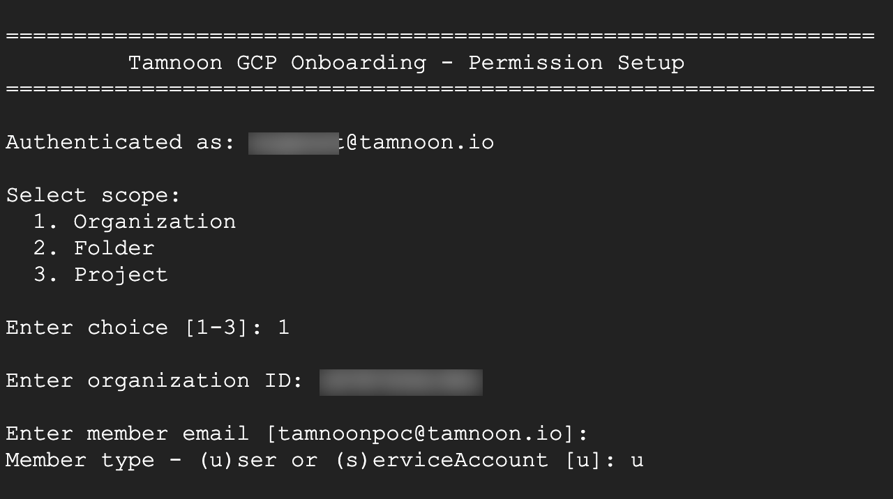
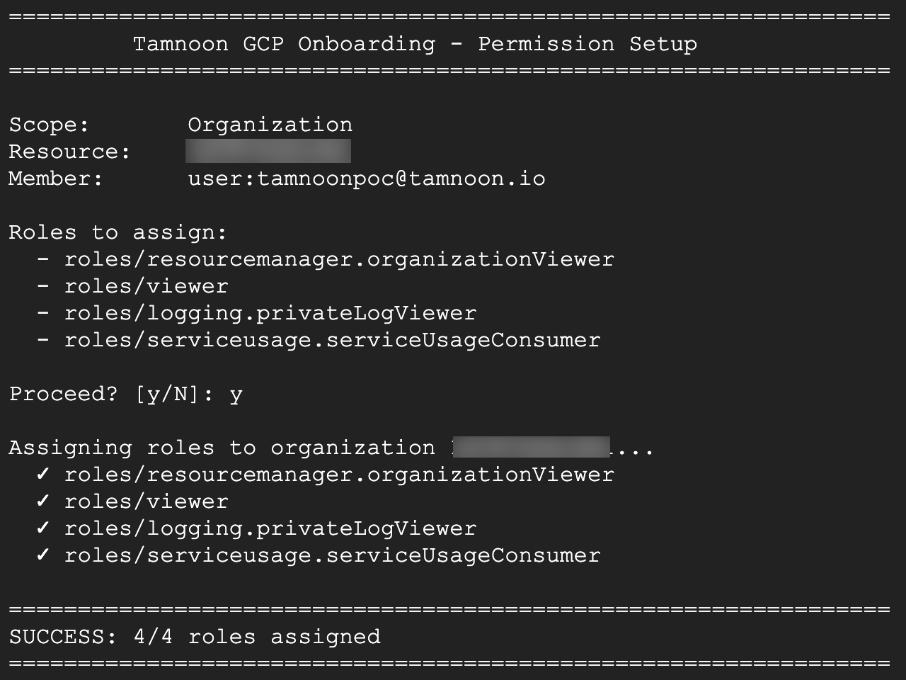

# GCP Onboarding Scripts

## poc_onboarding.py

Python script to assign Tamnoon onboarding permissions in Google Cloud Shell.

### Prerequisites

- Run in **Google Cloud Shell** (Python 3.x and gcloud CLI pre-installed)
- Authenticated with an account that has `setIamPolicy` permission at the target scope

### Usage

**Interactive mode:**
```bash
python3 poc_onboarding.py
```

**CLI mode:**
```bash
# Organization scope
python3 poc_onboarding.py --scope organization --org-id 123456789

# Folder scope (single or multiple folders)
python3 poc_onboarding.py --scope folder --folder-ids 111222333
python3 poc_onboarding.py --scope folder --folder-ids 111 222 333

# Project scope (single or multiple projects)
python3 poc_onboarding.py --scope project --project-ids my-project
python3 poc_onboarding.py --scope project --project-ids proj-a proj-b proj-c

# Skip confirmation prompt
python3 poc_onboarding.py --scope project --project-ids my-project -y

# Custom member
python3 poc_onboarding.py --scope project --project-ids my-project --member custom@example.com
```

### Options

| Option | Description |
|--------|-------------|
| `--scope` | Scope level: `organization`, `folder`, or `project` |
| `--org-id` | Organization ID (for organization scope) |
| `--folder-ids` | One or more folder IDs (for folder scope) |
| `--project-ids` | One or more project IDs (for project scope) |
| `--member` | Member email (default: `tamnoonpoc@tamnoon.io`) |
| `-y, --yes` | Skip confirmation prompt |

### Example: Organization Scope





### Roles Assigned

See [gcp-onboarding-permissions.md](../gcp-onboarding-permissions.md) for the complete list of roles assigned at each scope level.
